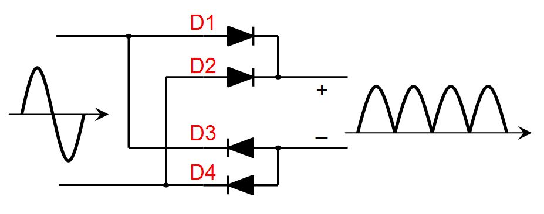
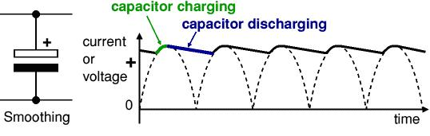

# Re-engineering of an LED Lamp

This project is a reverse engineering and documentation of a simple **capacitive dropper**-based LED driver circuit in inexpensive LED lamps.
The original device is a 220V AC powered LED light with 6 SMD LEDs.

## Project Contents
*   `photos/` - Images of the original PCB and components.
*   `schematics/` - Circuit diagram of the original design.
*   `README.md` - This file.

## Scheme

## Photos

## Key Measurements
*   Input Voltage: ~220V AC
*   Voltage after bridge & filter: ~17.8V DC
*   Forward Voltage per LED: ~2.8V
*   Total LED string voltage: ~15.0V

## BOM
| Component | Value / Name | Usage |
| :--- | :--- | :--- |
| **C1** | 0.22µF / CBB22 224J 400V | Ballast Capacitor |
| **R1** | 1M | Discharges C1 when unplugged |
| **U1** | MB10F | Diode Bridge |
| **C2** | 4.7µF 100V | Smoothing capacitor |
| **R2** | 150 | Current sense / limiting |
| **R3** | 300k | Discharges C2 |
| **D1-6** | SMD LED (Yellow, 2.8V) | Light |

## Some interesting studies

While working on the circuit, I consulted some people and articles to understand things that were not obvious to me:

1.  **How to measure current in a circuit:**
    - Shunt method
    
    I still need to try this (haven't done it yet).

2.  **How smoothing capacitors work:**

    

    Although I know how a diode bridge works, the voltage after it needs to be smoothed.

    

    For information on calculating the required voltage, you can read this article: [Tube Power Supplies](https://diyaudioprojects.com/Technical/Tube-Power-Supplies/). It references an interesting book: [Rectifier Applications Handbook](https://www.thierry-lequeu.fr/data/HB214.pdf).
