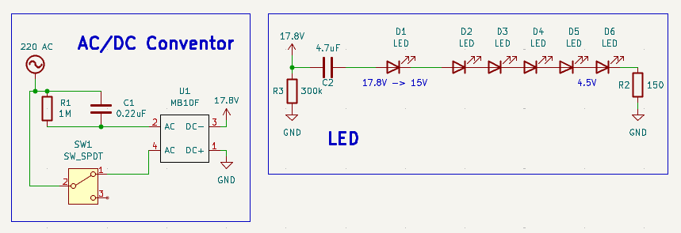
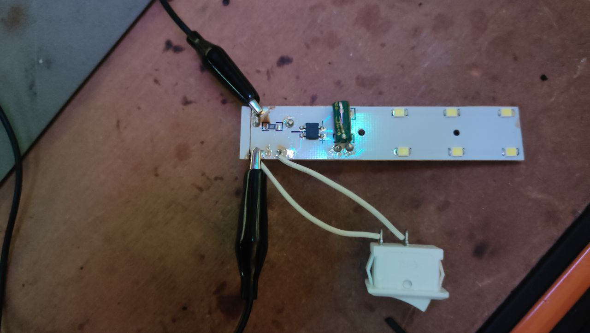

# Re-engineering of an LED Lamp

This project is a reverse engineering and documentation of a simple **capacitive dropper**-based LED driver circuit in inexpensive LED lamps.
The original device is a 220V AC powered LED light with 6 SMD LEDs.

## Project Contents
*   `photos/` - Images of the original PCB and components.
*   `schematics/` - Circuit diagram of the original design.
*   `README.md` - This file.

## Scheme

## Photos

## Key Measurements
*   Input Voltage: ~220V AC
*   Voltage after bridge & filter: ~17.8V DC
*   Forward Voltage per LED: ~2.8V
*   Total LED string voltage: ~15.0V

## BOM
| Component | Value / Name | Usage |
| :--- | :--- | :--- |
| **C1** | 0.22µF / CBB22 224J 400V | Ballast Capacitor |
| **R1** | 1M | Discharges C1 when unplugged |
| **U1** | MB10F | Diode Bridge |
| **C2** | 4.7µF 100V | Filter |
| **R2** | 150 | Current sense / limiting |
| **R3** | 300k | Discharges C2 |
| **D1-6** | SMD LED (Yellow, 2.8V) | Light |
